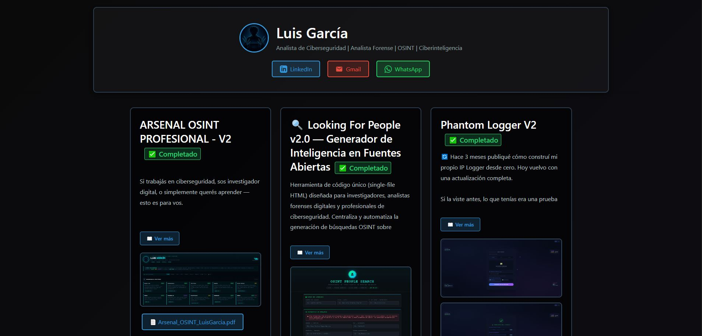
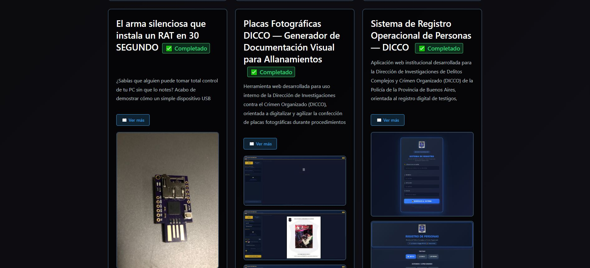
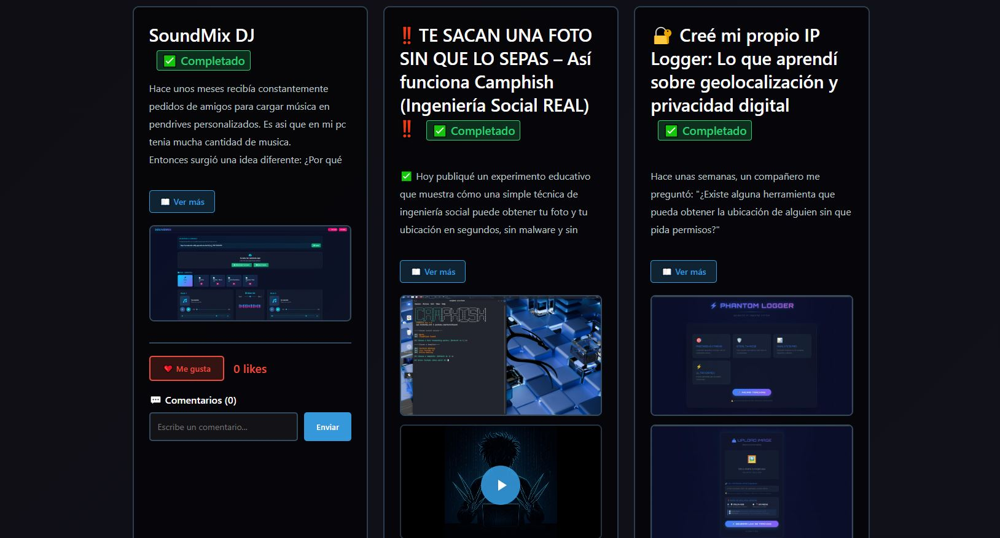
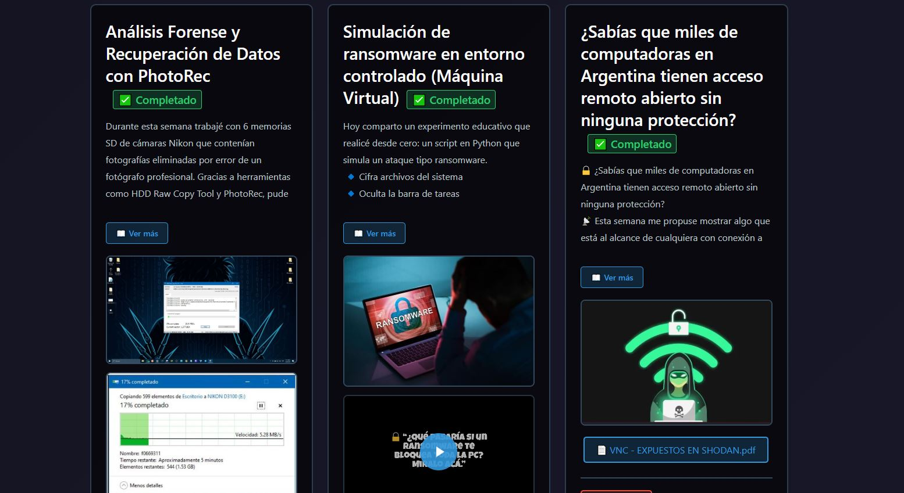

# 🛡️ Portfolio de Ciberseguridad — Luis García

> Portfolio web interactivo con panel de proyectos, sistema de likes y comentarios en tiempo real, y galería de certificaciones.

---

## 📸 Screenshots

## 🚀 Demo en vivo

**👉 [proyects-luis.netlify.app](https://proyects-luis.netlify.app/)**

---

## ✨ Funcionalidades

- 🗂️ **Galería de proyectos** con cards interactivas y links a demos en vivo
- ❤️ **Sistema de likes** por proyecto sincronizado en tiempo real
- 💬 **Comentarios** con Firebase Firestore
- 📜 **Sección de certificaciones** y formación académica
- 🔐 **Panel de administración** para gestionar contenido
- 📱 **Responsive** — funciona en móvil y desktop

---

## 🛠️ Stack técnico

| Tecnología | Uso |
|---|---|
| **HTML5 / CSS3 / JS** | Frontend completo, sin frameworks |
| **Firebase Firestore** | Base de datos de proyectos, likes y comentarios |
| **Firebase Storage** | Almacenamiento de imágenes |

---

## 👤 Autor

**Luis García** — [@LuisGarcia-InfoSec](https://www.linkedin.com/in/luis-garc%C3%ADa-8138762b6/)  
Analista de Ciberseguridad & Forense Digital · Buenos Aires, Argentina

---

*Este repositorio contiene el código fuente del portfolio. Los proyectos listados tienen sus propios repos independientes.*
